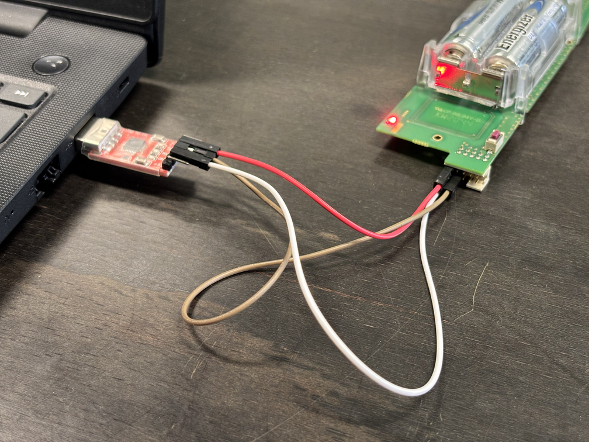
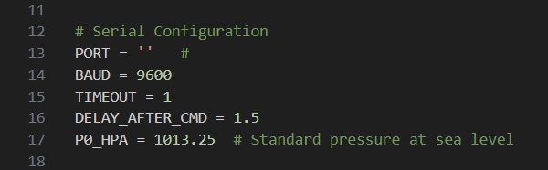

# RS41-SDE Serial Data Extractor
RS41-SDE is a script developed as part of the LuniSpace project, a school initiative that aims to launch weather radiosondes alongside real-time image transmission systems, as a simple solution to a practical need: obtaining and managing data from a radiosonde. It was created as part of a larger script that will be published shortly on my GitHub profile. 

This is a basic but functional tool that allows you to extract meteorological data serially from the radiosonde via a USB TTL adapter.

The code is deliberately basic, lightweight and easy to understand: its purpose is not to process or analyse the data, but to reliably perform the fundamental task of acquiring it. In other words, it simply extracts altitude, temperature, humidity and atmospheric pressure from the radiosonde and makes them available to the user, who can then manage, analyse or integrate them into other projects according to their needs.

# Requirements and Installation
The script is written in Python, so you need to verify that Python is installed on your system by running the command:
```bash
python --version
```
If Python is not installed, you will need to download and install it from the official website: https://www.python.org/downloads/
#
Next, you need to install the `pip` library, Python's package manager, because it allows you to easily add all the necessary external libraries. In this case, in the next step, we will install `pyserial`. You can download it and find installation instructions here: https://pip.pypa.io/en/stable/installation/
#
Next, you need to install the `pyserial` library, which allows the script to communicate with the radiosonde via the serial port. To install it, run the command:
```bash
pip install pyserial
```
#
In order to retrieve data from the radiosonde, you need to use a USB TTL adapter connected to your PC. This allows the script to communicate correctly with the radiosonde and retrieve meteorological data.
The image below shows the connection between the PC and the radiosonde via the adapter. 



#

There are two ways to install the script: by downloading the ZIP file directly from this GitHub repository and then extracting it to the desired folder, or by cloning the project via terminal. In the first case, simply click on Code and then on Download ZIP, unzip the archive, and access the project folder. Alternatively, you can download the entire repository by running the following command:
```bash
https://github.com/IU5TVE/RS41-SDE.git
```

# How to use
The image shows the first lines of the script, where you can configure some settings. Here you can choose whether to save the extracted data to a .txt file, set the output file path, and enter the serial communication port of the USB-TTL adapter.


By modifying the `Save_File` variable, you can decide whether to save the radiosonde data altitude, temperature, humidity, and atmospheric pressure in a .txt file in addition to displaying it on the screen. 

By setting `Save_File` to `0`, the file will not be created. 

By setting `Save_File` to `1`, the file will be generated in the path specified in the `File_Path` variable, overwriting the data received from the radiosonde each time.


Finally, you need to specify the serial communication port used to connect to the radiosonde and enter it in the `PORT` variable, for example `COM3` on Windows or `/dev/ttyUSB0` on Linux.


